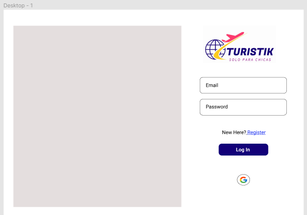
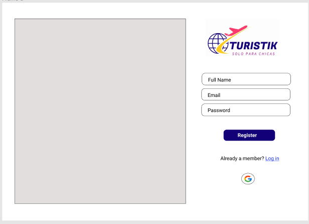
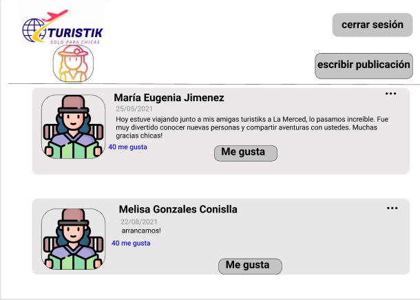
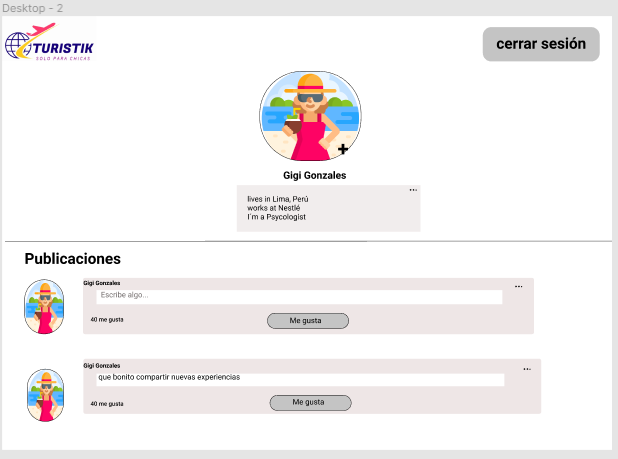
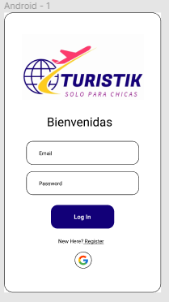
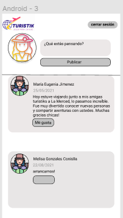
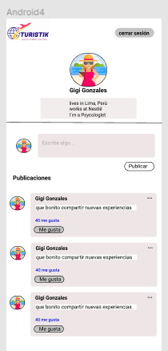

# Turistik (solo para chicas)
## Índice

* [1. Preámbulo](#1-preámbulo)
* [2. Acerca de Turistik](#2-acerca-de-turistik)
* [3. Prototipo en Figma](#3-prototipo-en-figma)
* [4. MVP Funcional](#4-mvp-funcional)
* [5. Objetivos de aprendizaje](#5-objetivos-de-aprendizaje)

## 1. Preámbulo
  Instagram, Snapchat, Twitter, Facebook, Twitch, Linkedin,etc. Las redes sociales han invadido nuestras vidas. Lasamamos u odiamos, y muchos no podemos vivir sin ellas. Hayredes sociales de todo tipo y para todo tipo de intereses.Nosotras decidimmos crear una red social desarrollada conjavascript, html y css. Como API implementamos Firebase. Losinvitamos a conocer un poco más de nuestra SPA.
***

## 2. Acerca de Turistik
  Nuestro proyecto "Turistik" es una plataforma creada para mujeres que deseen conocer nuevos lugares y que por diferentes motivos tengan que viajar solas. Como ya es conocida dentro de nuestra realidad suele ser peligroso ir a lugares nuevos y alejados para una mujer cuando no está en compañía de alguna persona conocida. Es por ello, que nace Turistik para poder ser el nexo necesario que necesitan y conocer alguna otra usuaria que tenga los mismos intereses que ella y poder juntas generar un ambiente sororo. Además, de poder encontrar una compañía divertida y segura, también las usuarias pueden encontrar tips y consejos basados en la experiencia y conocimientos de las demás. En sencillas palabras, Turistik tiene como finalidad crear una comunidad sorora entre mujeres que quieren viajar seguras, compartir sus experiencias y promover el turismo entre las ellas.

 * ***Log In***

* ***Register***

* ***Home***

***

## 3. Prototipo en Figma
  El prototipo que realizamos inicialmente es el que presentamos a continuación, como se puede apreciar, son dos presentaciones, para mobile y desktop. Este prototipo fue sometido a un testeo de usabilidad, con 5 mujeres con edades entre 18 y 36 años. Las recomendaciones y el feedback hicieron que modifiquemos nuestro proyecto final.

#### Diseño Desktop

* ***Log In***

    

* ***Register***

    

* ***Home***

    

* ***Profile***

    

#### Diseño Mobile

* ***Log In***

    

* ***Register***

    

* ***Home***

    

* ***Profile***

    

***

## 4. MVP Funcional
  Finalmente, nuestro aplicativo final tiene las siguientes funcionalidades:

 * Diseño responsive (Todos los dispositivos).

 * Permite que una usuaria se registre con correo electrónico y se autentique con gmail.

 * Una vez registrada, la usuaria podrá loguearse con su correo y contraseña registrados y si se autentifica con gmail podrá ingresar directamente al Home.

 * En el Home, la usuaria podrá observar sus publicaciones y las publicaciones de las demás, podrá dar like, editar y borrar a las publicaciones.

 * En el perfil la usuaria puede ver exclusivamente sus publicaciones y gestionarlas más facilmente.

## 5. Objetivos de aprendizaje

#### HTML

-  Uso de HTML semántico

#### CSS

- Uso de selectores de CSS

- Modelo de caja (box model): borde, margen, padding

- Uso de flexbox en CSS

- Uso de CSS Grid Layout

#### Web APIs

- Uso de selectores del DOM

- Manejo de eventos del DOM (listeners, propagación, delegación)

- Manipulación dinámica del DOM

- Ruteado (History API, evento hashchange, window.location)

#### JavaScript

- Arrays (arreglos)

- Objetos (key, value)

- Diferenciar entre tipos de datos primitivos y no primitivos

- Variables (declaración, asignación, ámbito)

- Uso de condicionales (if-else, switch, operador ternario, lógica booleana)

- Uso de bucles/ciclos (while, for, for..of)

- Funciones (params, args, return)

- Pruebas unitarias (unit tests)

- Pruebas asíncronas

- Uso de mocks y espías

- Módulos de ECMAScript (ES Modules)

- Uso de linter (ESLINT)

- Uso de identificadores descriptivos (Nomenclatura y Semántica)

- Diferenciar entre expresiones (expressions) y sentencias (statements)

- Callbacks

- Promesas

#### Control de Versiones (Git y GitHub)

- Git: Instalación y configuración

- Git: Control de versiones con git (init, clone, add, commit, status, push, pull, remote)

- Git: Integración de cambios entre ramas (branch, checkout, fetch, merge, reset, rebase, tag)

- GitHub: Creación de cuenta y repos, configuración de llaves SSH

- GitHub: Despliegue con GitHub Pages

- GitHub: Colaboración en Github (branches | forks | pull requests | code review | tags)

- GitHub: Organización en Github (projects | issues | labels | milestones | releases)

### UX (User eXperience)

- Diseñar la aplicación pensando en y entendiendo al usuario

- Crear prototipos para obtener feedback e iterar

- Aplicar los principios de diseño visual (contraste, alineación, jerarquía)

- Planear y ejecutar tests de usabilidad

### Firebase

- Firebase Auth

- Firestore