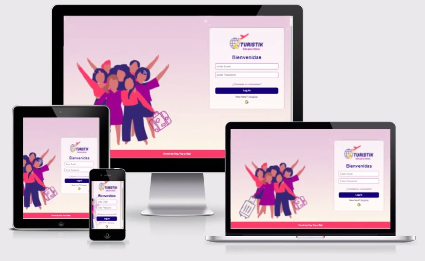
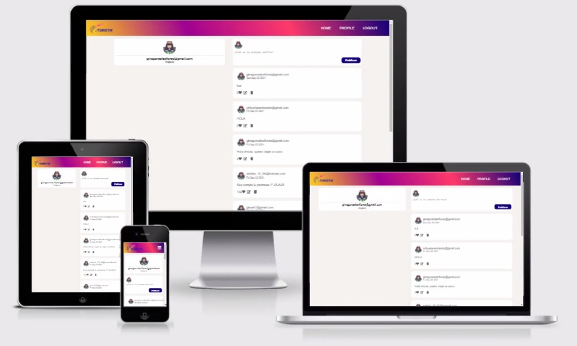

# **Turistika** (solo para chicas)
## **1. Preambulo**
    Instagram, Snapchat, Twitter, Facebook, Twitch, Linkedin, etc. Las redes sociales han invadido nuestras vidas. Las amamos u odiamos, y muchos no podemos vivir sin ellas. Hay redes sociales de todo tipo y para todo tipo de intereses. Nosotras decidimmos crear una red social desarrollada con javascript, html y css. Como API implementamos Firebase. Los invitamos a conocer un poco más de nuestra SPA.
***

## **2. Acerca de Turistik**
    Nuestro proyecto "Turistik" es una plataforma creada para mujeres que deseen conocer nuevos lugares y que por diferentes motivos tengan que viajar solas. Como ya es conocida dentro de nuestra realidad suele ser peligroso ir a lugares nuevos y alejados para una mujer cuando no está en compañía de alguna persona conocida. Es por ello, que nace Turistik para poder ser el nexo necesario que necesita para conocer alguna otra usuaria que tenga los mismos intereses que ella y poder juntas generar un ambiente sororo entre ellas. Además, de poder encontrar una compañía divertida y sorora, también las usuarias pueden encontrar tips y consejos basados en la experiencia y conocimientos de las demás. En sencillas palabras, Turistik tiene como finalidad crear una comunidad sorora entre mujeres que quieren viajar seguras, compartir sus experiencias y promover el turismo entre las mujeres.

 * ***Log In***

* ***Register***

* ***Perfil***

***

## **3. Prototipo en Figma**
    El prototipo que realizamos inicialmente es el que presentammos a continuacion, como se puede apreciar, son dos presentaciones, para mobile y desktop. Este prototipo fue sometido a un testeo de usabilidad, con 5 mujeres con edades entre 18 y 36 años. Las recomendaciones y el feedback hicieron que modifiquemos nuestro proyecto final. 

#### ***Diseño Desktop***
* ***Log In***

* ***Register***

* ***Home***

* ***Profile***

#### ***Diseño Mobile***
* ***Log In***

    

* ***Register***

    

* ***Home***

    

* ***Profile***

    

***
 
## **4. EVP Funcional**
    Finalmente, nuestro aplicativo final tiene las siguientes funcionalidades: 

 * Permite que una usuaria se registre con correo electronico y se autentique con gmail.

 * Una vez registrada, la usuaria podrá loguearse con su correo y contraseña registrados y si se autentifica con gmail podrá ingresar directamente al Home.

 * En el Home, la usuaria podrá observar sus publicaciones y las publicaciones de las demás, podrá dar like, editar y borrar a las publicaciones.

 * En el perfil la usuaria puede ver exclusivamente sus publicaciones y gestionarlas más facilmente.

